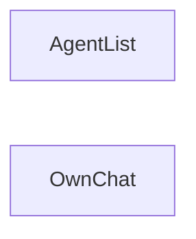

# Architectural design — owner agent standing

**Functional specification.** `plans/owner-agent-standing-functional-spec.md`

**Functional specification status.** Draft — user said to design anyway

**Based on.** An unaccepted functional specification.

**Language.** TypeScript

**Program-text unit.** one TypeScript file

**Language source.** repo assumption

**Status.** Draft for designer review

**Realizes.** External behavior of the functional specification, unchanged.

---

## 1. Modules

```
module AgentList
  class: function
  instances: one
  memory: no
  mutable: —
  program text: one TypeScript file
  meaning: Presents each owned agent’s site and agent standing from that owner’s agent facts.
  realizes:
    - showList
  uses: —
  provides:
    - showList
  task: one
```

```
module OwnChat
  class: machine
  instances: one
  memory: yes
  mutable: —
  program text: one TypeScript file
  meaning: Holds ChatState and presents this browser’s thread as this browser’s own chat.
  realizes:
    - openOwnChat
  uses: —
  provides:
    - openOwnChat
  task: one
```

| Module | Meaning | Realizes | Uses |
|---|---|---|---|
| AgentList | Presents each owned agent’s site and agent standing from that owner’s agent facts. | showList | — |
| OwnChat | Holds ChatState and presents this browser’s thread as this browser’s own chat. | openOwnChat | — |

`showList` does not read `ChatState`. `openOwnChat` does not read agent facts. They are two modules so each meaning stays one unit.

### Excluded

No modules for these. They are excluded by the functional specification.

| Item | Disposition |
|---|---|
| G3 | later |
| G4 | later |
| G5 | later |
| Suggested questions stay as they are | not at all |
| A refresh clears the thread | not at all |
| Charts, funnels, or alerts about use | not at all |
| Visitor chat | unchanged — no new exchange |
| Who sees the own-chat fact | pending |
| Online | pending |

---

## 2. Module dependency diagram

Neither module uses the other. Arrow means `uses`. There is no arrow.



---

## 3. Module interfaces

### AgentList

**Meaning.** Presents each owned agent’s site and agent standing from that owner’s agent facts.

```
service showList
  of module: AgentList
  meaning: The external list of each owned agent’s site and agent standing.
  same as: showList
```

### OwnChat

**Meaning.** Holds ChatState and presents this browser’s thread as this browser’s own chat.

```
service openOwnChat
  of module: OwnChat
  meaning: The external opening of this browser’s chat with one owned agent.
  same as: openOwnChat
```

`ChatState` stays inside `OwnChat`. `AgentList` does not receive it.

---

## 4. Realization

| External operation | Module service | Judgment |
|---|---|---|
| showList | `AgentList.showList` | `same as: showList`. Inputs, outputs, properties, conditions, and the empty state clause are unchanged. |
| openOwnChat | `OwnChat.openOwnChat` | `same as: openOwnChat`. Inputs, outputs, properties, conditions, and the `ChatState` clause are unchanged. `next` stays unchanged. |

---

## 5. Consistency

Checked against the architectural-design notation.

| Check | Result |
|---|---|
| Meaning, region, and one task | pass |
| Classification | pass |
| Services owned by one module | pass |
| External operations not restated | pass |
| Uses and diagram match | pass |
| Interfaces usable without implementation | pass |
| Every external operation realized once | pass |
| No orphans, no excluded items | pass |
| No data structures or algorithms | pass |
| One owner for each state | pass |
| No extra modules | pass |

`OwnChat` is the only owner of `ChatState`.

### Assumptions

- The implementation language is TypeScript, and one module is one TypeScript file. The requirements record does not name a language. This repo is TypeScript.
- Two modules, not one. A single module would both ignore `ChatState` and hold it.

### Review

- **Presented.** Dependency diagram and module interfaces.
- **Reviewer.** Designers and programmers of the modules.
- **Judgment.** Pending
