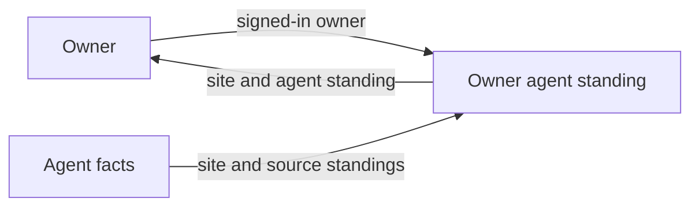
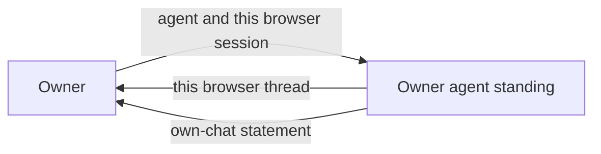

# Functional specification — owner agent standing

**Requirements.** `plans/owner-agent-standing-requirements.md`

**Requirements status.** Accepted 2026-09-27

**Status.** Draft for customer review

**Specifies.** This-version external behavior only.

---

## 1. System classification

```
system Owner agent standing
  class: machine
  instances: one
  memory: yes
  mutable: —
```

One product, one Your agents list for the signed-in owner. Opening a chat again shows messages from earlier in this browser, so some outputs depend on previous interactions. Each agent is a data object in that one system. This version does not create another instance of the system when the owner opens an agent.

---

## 2. System concepts

```
concept Agent
  definition: A saved chat that belongs to one owner.
  refines: Agent
  user must know: yes

concept Site
  definition: The website URL of an agent, or the words “there is no website.”
  refines: Site
  user must know: yes

concept Knowledge source
  definition: One imported page, file, or pasted text on an agent.
  refines: Knowledge source
  user must know: yes

concept Source standing
  definition: The word on one knowledge source — Ready, Importing, or Failed.
  refines: Knowledge standing
  user must know: yes

concept Agent standing
  definition: The knowledge words Your agents shows for the whole agent — “the agent has no knowledge,” Failed, Importing, or Ready.
  refines: Knowledge standing
  user must know: yes

concept Your agents
  definition: The owner’s list of their agents.
  refines: Your agents
  user must know: yes

concept Browser session
  definition: One browser’s chat with one agent.
  refines: Browser session
  user must know: yes

concept Thread
  definition: The messages in one browser session.
  refines: Thread
  user must know: yes

concept Own-chat statement
  definition: A statement that a thread is this browser’s chat and is not questions from other people.
  refines: —
  user must know: yes
```

| Term | User must know | Refines |
|---|---|---|
| Agent | yes | Agent |
| Site | yes | Site |
| Knowledge source | yes | Knowledge source |
| Source standing | yes | Knowledge standing |
| Agent standing | yes | Knowledge standing |
| Your agents | yes | Your agents |
| Browser session | yes | Browser session |
| Thread | yes | Thread |
| Own-chat statement | yes | — |

---

## 3. Abstract data types

```
type Owner
  class: immutable
  instances: the signed-in person who has agents
  fixed set: yes

type Agent
  class: immutable
  instances: one saved chat belonging to one owner
  fixed set: yes

type Site
  class: immutable
  instances: one agent’s website URL, or “there is no website”
  fixed set: yes

type SourceStanding
  class: immutable
  instances: Ready, Importing, or Failed
  fixed set: yes

type KnowledgeSource
  class: immutable
  instances: one imported page, file, or pasted text, with one source standing
  fixed set: yes

type AgentStanding
  class: immutable
  instances: “the agent has no knowledge,” Failed, Importing, or Ready
  fixed set: yes

type AgentFacts
  class: immutable
  instances: the site and the knowledge sources of every agent that belongs to one owner
  fixed set: yes

type ListedAgents
  class: immutable
  instances: the site and the agent standing of every agent in one AgentFacts
  fixed set: yes

type BrowserSession
  class: immutable
  instances: one browser’s chat with one agent
  fixed set: yes

type Thread
  class: immutable
  instances: the messages in one browser session
  fixed set: yes

type OwnChatStatement
  class: immutable
  instances: a statement that a thread is this browser’s chat and is not questions from other people
  fixed set: yes

type ChatState
  class: immutable
  instances: the thread already held for each browser session
  fixed set: yes
  summarizes: messages already received in each browser session
```

This version does not create, modify, or destroy agents, sites, or knowledge sources. `ChatState` is a value the machine holds. Opening a chat does not replace it.

---

## 4. External interfaces

`showList` is the requirements rows Agent list and Agent facts. The facts flow in. The list flows out. They are one interaction.

```
interface Agent list
  counterpart: Your agents, Agent
  direction: both
  requirements: G1.1, G1.2, F1
  operations:
    - showList
```

```
operation showList
  of: AgentFacts
  kind: function
  in:
    - owner: Owner
    - facts: AgentFacts
  in properties:
    - owner is signed in
  out:
    - when every agent in facts belongs to owner:
        - listed: ListedAgents
    - otherwise:
        - none
  out properties:
    - listed has one entry for every agent in facts
    - that entry’s site is the agent’s URL when the agent has a site
    - that entry’s site is “there is no website” when the agent has no site
    - that site is included whether or not another agent has the same name
    - that entry’s agent standing is “the agent has no knowledge” when the agent has no knowledge source
    - otherwise that agent standing is Failed when any of the agent’s source standings is Failed
    - otherwise that agent standing is Importing when any of the agent’s source standings is Importing
    - otherwise that agent standing is Ready when every one of the agent’s source standings is Ready
    - Failed, Importing, and Ready on listed are the same words as those source standings
  state:
    reads: —
    writes: —
    next: —
  witness:
    - Owner sees those same Ready, Importing, or Failed words, not a second standing
```

`otherwise: none` rejects facts that include an agent the owner does not own. No list is shown for those facts.

```
interface Own chat
  counterpart: Hosted chat, browser session
  direction: out
  requirements: G2.1, G2.2, F2
  operations:
    - openOwnChat
```

```
operation openOwnChat
  of: Thread
  kind: machine
  in:
    - owner: Owner
    - agent: Agent
    - session: BrowserSession
  in properties:
    - owner owns agent
    - the person opening the chat is that owner
    - session is this browser’s session with that agent
  out:
    - when owner owns agent and session is this browser’s session with that agent:
        - thread: Thread
        - statement: OwnChatStatement
  out properties:
    - thread is the messages in reads for that session
    - thread has no other browser session’s messages
    - statement says that thread is this browser’s chat and is not questions from other people
  state:
    reads: ChatState
    writes: ChatState
    next: unchanged
```

A later `openOwnChat` for the same session reads the same thread, because no operation in this specification changes `ChatState`.

### Excluded

Named, not specified.

| Requirements id | Disposition |
|---|---|
| G3 | later |
| G4 | later |
| G5 | later |
| Suggested questions stay as they are | not at all |
| A refresh clears the thread | not at all |
| Charts, funnels, or alerts about use | not at all |
| Visitor chat | unchanged — no new exchange, no operation |
| Who sees the own-chat fact | pending |
| Online | pending |

---

## 5. User’s manual

### Concepts you need

- **Agent** — a saved chat that belongs to you.
- **Site** — that agent’s website URL, or the words “there is no website.”
- **Knowledge source** — one imported page, file, or pasted text on the agent.
- **Source standing** — Ready, Importing, or Failed on one knowledge source.
- **Agent standing** — what Your agents shows for the agent’s knowledge: “the agent has no knowledge,” Failed, Importing, or Ready.
- **Your agents** — your list of agents.
- **Browser session** — this browser’s chat with one agent.
- **Thread** — the messages in that browser session.
- **Own-chat statement** — a statement that those messages are this browser’s chat and are not questions from other people.

### Commands

```
command Open Your agents
  supplies: the signed-in owner
  sees: a site and an agent standing for every agent that belongs to that owner, when those facts are that owner’s
  operation: showList
```

Open Your agents. You do not type the site or the standing. For every agent you own, you see its website URL, or “there is no website.” You see that line even when no other agent has the same name. You also see the agent’s knowledge: “the agent has no knowledge” when it has no knowledge source; otherwise Failed if any source is Failed; otherwise Importing if any source is Importing; otherwise Ready when every source is Ready. Failed, Importing, and Ready are the same words you already see on those sources.

```
command Open an agent’s chat
  supplies: the owner, the agent, and this browser’s session with that agent
  sees: this browser’s thread, and the own-chat statement, when you own that agent
  operation: openOwnChat
```

From Your agents, open that agent’s chat. You see the messages already in this browser’s chat with that agent. They are not questions from other people. You see a statement that says so. When you open that chat again, the same messages are still there.

### What you will not see in this version

- What other people asked.
- Whether a suggested question was answered “I don't have that information in my knowledge base.”
- Whether the share link or the embed was opened.
- Charts, funnels, or alerts about use.
- A cleared thread when the chat is opened again.
- Any change to suggested questions.
- A new exchange on a visitor’s chat.

### Diagrams





### For designers of external systems

**Agent.** On `showList`, send the site and the source standings of the owner’s agents. The list that comes back is one site line and one agent standing per agent, under the conditions in `showList`. This version does not define a new way to change a site or a source.

**Visitor.** No new data flows in or out. Suggested questions are unchanged.

---

## 6. Consistency and trace

### Consistency

Checked against the functional-specification notation.

| Check | Result |
|---|---|
| Classification table | pass |
| Types and operations agree | pass |
| Every role and concept defined | pass |
| Function vs machine memory | pass |
| Conditions partition inputs | pass |
| Manual matches operations | pass |
| No internal structure | pass |
| Excluded items have no operations | pass |

`Thread` is immutable as a value. `openOwnChat` is a machine step because the thread comes from `ChatState`. It does not create, modify, or destroy threads. `next: unchanged`.

### Requirements trace

| Operation | Requirements | Judgment |
|---|---|---|
| showList | G1.1, G1.2, F1 | Every owned agent is listed with its site, including when the name is unique and when there is no website. Agent standing is the accepted rollup, in the same words as the sources. G1.2 said “Ready or Failed”; the accepted rollup also shows Importing and “the agent has no knowledge.” |
| openOwnChat | G2.1, G2.2, F2 | The thread is this browser’s messages, and opening again does not change them. The statement says they are this browser’s chat and not other people’s questions. |

| Requirement | Met by | Judgment |
|---|---|---|
| G1.1 | showList | Site is on every entry. “there is no website” covers an agent with no site. The duplicate-name case does not hide it. |
| G1.2 | showList | Failed, Importing, Ready, or “the agent has no knowledge,” by the accepted rollup. |
| G2.1 | openOwnChat | The thread is the messages already in that browser session, and the next state is unchanged. |
| G2.2 | openOwnChat | The own-chat statement is how the owner can tell. Online is pending and is not part of this meeting. |
| F1 | showList | The list shows site and agent standing for each owned agent. |
| F2 | openOwnChat | Opening the owner’s chat produces the thread and the statement. |

### Assumptions

- One machine, not one system instance per agent. Agents cross the boundary as data. The objects the owner sees do not change under the other reading.
- The own-chat statement is defined by what it tells the owner, not by a fixed sentence or a screen position.
- The witness on `showList` is the accepted record’s performance row: the same words, and no second standing. No time bound was stated.

### Customer review

- **Presented.** Concepts, commands, conditions, diagrams.
- **Customer judgment.** Pending
