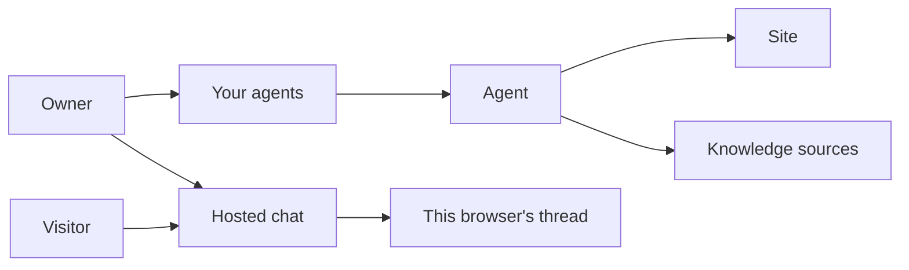
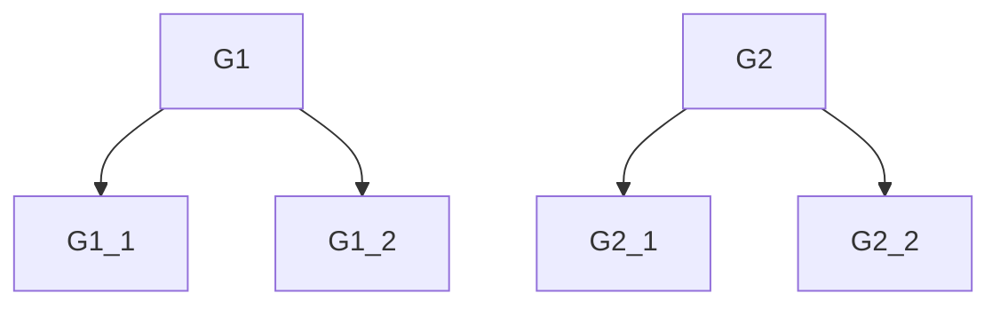

# Requirements — owner agent standing

**Customer statement (verbatim).** “review the website from the standpoint of having created agents and you want to monitor them - write down expectations versus reality and what should be possible in the tool now which isn't”

From that review, in the reviewer’s words: “I already have agents. I wanted to see if anyone is using them, what they asked, and whether the answers were any good.” On Your agents they saw only the name, plus Chat, Embed snippet, and Edit. The site and “Ready” appeared only after Edit. Chat opened the public widget, including a green “Online”, and a new tab still showed their own test (“What are your prices?” / “I don't have that information in my knowledge base.”). They could treat that thread as customer activity.

**Status.** Accepted 2026-09-27

**This version vs later vs not at all.** This version shows each agent’s site on Your agents, or that there is no website, and shows its knowledge as Failed if any source is Failed, otherwise Importing if any is Importing, otherwise Ready if every source is Ready, or that the agent has no knowledge when it has none. The opened chat is this browser’s own thread. Visitor questions, link opens, and changes to suggested questions are not this version.

---

## 1. Environment model

Simplified model of the world the system sits in. Not a design of the system.

### Actors

| Actor | Definition |
|---|---|
| Owner | The signed-in person who already has agents and opens Your agents. |
| Visitor | A person who chats with an agent and does not need an account. |

### Concepts (vocabulary)

| Term | Definition | Notes |
|---|---|---|
| Agent | A saved chat the owner can open, edit, and share. | One owner’s agent. |
| Site | The website URL the owner set for that agent. | The Website URL on Edit. Not the title of an imported page. |
| Knowledge source | One imported page, file, or pasted text on the agent. | |
| Knowledge standing | The word the owner already sees on a knowledge source: Ready, Importing, or Failed. | Ready means the chat can use it. Failed means the import did not succeed. Importing means it is not finished. |
| Your agents | The owner’s list of their agents. | |
| Browser session | One browser’s chat with one agent. | Kept and restored for that browser. Not a record of other people. |
| Thread | The messages in one browser session. | Includes the owner’s own test messages when the owner is the one chatting. |
| Suggested question | A one-tap question the visitor chat offers. | Unchanged in this version. |
| Share link | The public chat link for an agent. | Anyone with it can chat. |
| Embed | The snippet that puts the same agent on a site. | |

### Existing artifacts

| Artifact | What it already is |
|---|---|
| Your agents | Lists the owner’s agents by name, with Chat, Embed snippet, and Edit. A site is shown only when two agents share a name. |
| Edit | Where the owner sets the site and sees each knowledge source’s standing. |
| Hosted chat | The public chat for an agent. Restores that browser’s thread. Shows “Online” in the header. |
| Share page | The share link and the embed snippet. No record of opens. |
| Product map | Says a refresh clears the conversation. The live chat keeps the browser session’s thread. |

### Relationships

- An agent belongs to one owner.
- A site is part of an agent. An agent may have no site.
- A knowledge source is part of an agent. An agent may have none.
- A thread belongs to one browser session and one agent.
- Your agents lists the owner’s agents.
- Chat from Your agents opens that agent’s hosted chat in this browser.
- A visitor’s thread is a different browser session from the owner’s.

### Invariants

- A visitor can chat without an account.
- A browser session’s thread is that browser’s messages, not what other people asked.
- This version does not remove or rewrite suggested questions.
- This version does not clear a browser session’s thread on refresh.
- Prospector is not how an owner monitors agents.

---

## 2. Goals and required functions

User terms. Leaves defined with the vocabulary above.

### Hierarchy

- **G1** From Your agents, the owner can tell what each agent is for and whether its knowledge is usable.
  - **G1.1** Every agent on Your agents shows its site, including when no other agent has the same name.
  - **G1.2** Every agent on Your agents shows whether its knowledge is Ready or Failed.
- **G2** The owner can open an agent’s chat without taking that thread for what other people asked.
  - **G2.1** The messages are this browser’s thread, and they are still there after the chat is opened again.
  - **G2.2** The owner can tell that those messages are this browser’s chat and are not questions from other people.

### Functions the system must perform

| ID | Function | Defined in terms of |
|---|---|---|
| F1 | Show each agent’s site and Ready or Failed standing on Your agents. | Owner, Agent, Site, Knowledge standing, Your agents |
| F2 | When the owner opens that agent’s chat, state that the thread is this browser’s own chat. | Owner, Hosted chat, Browser session, Thread |

### Negotiation

| ID | This version | Later | Not at all |
|---|---|---|---|
| G1.1 | x | | |
| G1.2 | x | | |
| G2.1 | x | | |
| G2.2 | x | | |
| G3 Tell the owner when a suggested question was answered “I don't have that information in my knowledge base.” | | x | |
| G4 The owner can read what other people asked. | | x | |
| G5 The owner can see whether the share link or the embed was opened. | | x | |
| Suggested questions stay as they are on the visitor chat. | | | x |
| A refresh clears the thread. | | | x |
| Charts, funnels, or alerts about use. | | | x |

Issues: [#80](https://github.com/mkarots/tinygpt/issues/80) G1, [#81](https://github.com/mkarots/tinygpt/issues/81) G2, [#82](https://github.com/mkarots/tinygpt/issues/82) G3, [#83](https://github.com/mkarots/tinygpt/issues/83) G4, [#84](https://github.com/mkarots/tinygpt/issues/84) G5.

---

## 3. Performance constraints

| Constraint | Measure | Bound | Source |
|---|---|---|---|
| none stated | | | |
| List standing matches the sources | same words the owner already sees on those sources | no separate delay called out | unstated → proposed |

---

## 4. Implementation constraints

| Type | Constraint | Source |
|---|---|---|
| Environment | The existing TinyGPT web app, signed-in owner, hosted chat, and browser session. Google sign-in stays as it is. | familiar |
| Form | One product. Your agents stays the owner’s list. Do not send the owner to Prospector to see an agent. | familiar |
| Form | The early-user product map must not say that a refresh clears the conversation. | follows the accepted thread answer |
| Methods | New behavior gets tests, in the style the repo already uses. | familiar |

---

## 5. Resource constraints

| Constraint | Bound | Source |
|---|---|---|
| Schedule | none stated | |
| Budget | none stated | |
| People / agent-time | none stated | assumption: small enough to ship with the current app, no extra team |

---

## 6. External interfaces

| Interface | Counterpart | Purpose | Direction |
|---|---|---|---|
| Agent list | Your agents | Site and Ready or Failed standing for each of the owner’s agents | out |
| Own chat | Hosted chat, browser session | This browser’s thread, marked as this browser’s chat and not other people’s questions | out |
| Agent facts | Agent | Site and knowledge standings already stored for the agent | in |
| Visitor chat | Visitor, hosted chat | Unchanged. No new exchange in this version. | both |

---

## Unstated requirements

| Item | Class | Proposed requirement | Customer |
|---|---|---|---|
| Mixed sources | computer-motivated | The agent is Failed if any source is Failed. Otherwise Importing if any source is Importing. Otherwise Ready if every source is Ready. | accept |
| No sources | computer-motivated | Your agents says the agent has no knowledge, rather than Ready or Failed. | accept |
| No site | computer-motivated | Your agents says there is no website, rather than leaving the site blank. | accept |
| Who sees the own-chat fact | familiar | Only the owner of that agent. A visitor’s chat is not given an owner notice. | pending |
| Online | computer-motivated | The green “Online” header stays. It is not a statement that people are using the agent. | pending |

---

## Consistency and review

- **Defined terms.** Site, knowledge standing, Your agents, browser session, and thread are defined in §1 and used in the leaves.
- **Conflicts.** “Refresh clears the conversation” in the product map contradicts G2.1. This version keeps the thread. The map sentence is not a requirement.
- **Blocking questions asked.** (1) This version is the list facts plus labeling this browser’s chat; visitor inbox and link opens are later. (2) Suggested questions on the visitor chat stay as they are. (3) The browser’s thread stays and must be labeled as this browser’s chat. Record written after those answers.
- **Implications presented to the customer.** See the review reply with this file.
- **Customer judgment.** accepted 2026-09-27. With that acceptance: knowledge rollup, no sources, and no website as proposed. Who sees the own-chat fact, and Online, stay pending.
